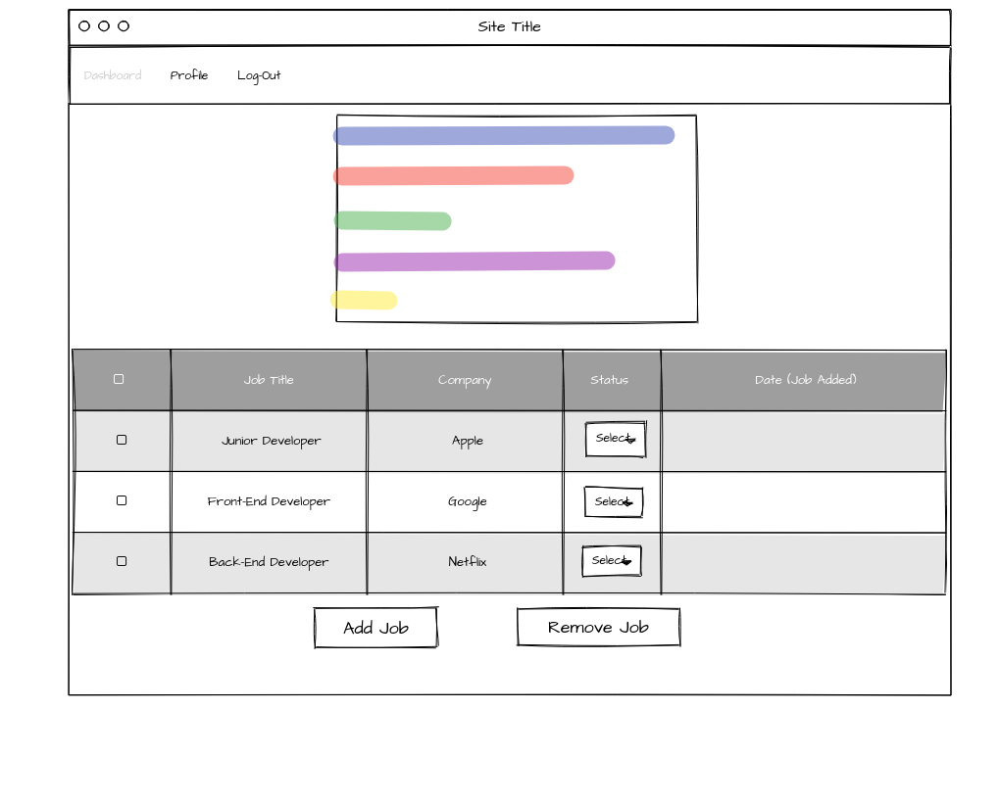
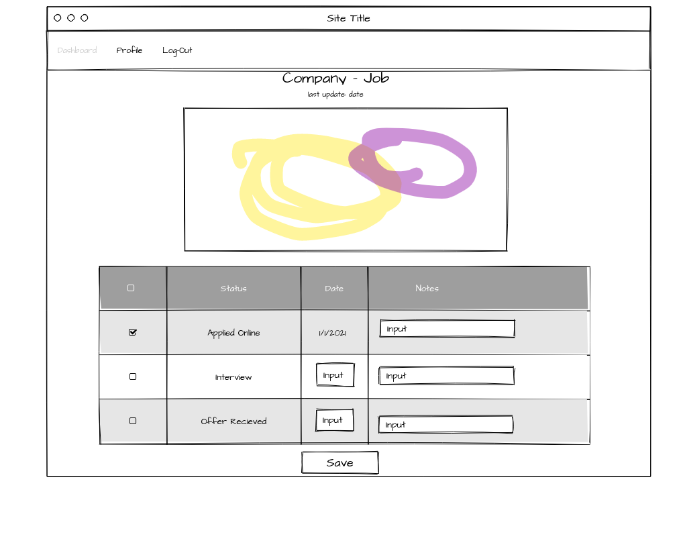

# Job Status Tracker

## Description
This application serves as a one-stop shop to track where you are with the job search. 

## User Story
GIVEN I am a user
WHEN I provide my email and password
THEN I am shown my dashboard of job statuses

GIVEN I am a user
WHEN I click on add job
THEN I can add what company, what position, which link, and with who I applied

GIVEN I am a user
WHEN I click on a job
THEN I can update that status

GIVEN I am a user
WHEN I am in an interview
THEN I can add notes

* future development:

GIVEN I am a user
WHEN I click on profile
THEN I am able to 

GIVEN I am a user
WHEN I login
THEN I can see new jobs posted on glassdoor

GIVEN I am a user
WHEN I apply to jobs
THEN that company's rating, salary expectation

GIVEN I am a user
WHEN I want to compare jobs
THEN I select the jobs to compare and see the comparison

## Wireframe
Login:

Dashboard:

Specific Job:

## APIs to Be Used
* Moment API for status updates
* ChartJS

## Rough Breakdown of Tasks
* Caroline Miller - put (updating job input), post, get, delete, authentication
* Payton Whinnery - initial file structure, login (home route login)
* Rachel Amos - chartjs, modals (add/remove job)
* Jackie Hodges - dashboard (not yet applied, applied online, rejected, interview, offer, accepted), handlebars specific job page

